# nuScenes 数据集笔记

[TOC]

## 0. 参考学习

+ 数据集下载：https://www.nuscenes.org/nuscenes
+ 数据集工具箱：https://github.com/nutonomy/nuscenes-devkit
+ 数据集格式解析中文fanyi

## 1. 地图定义

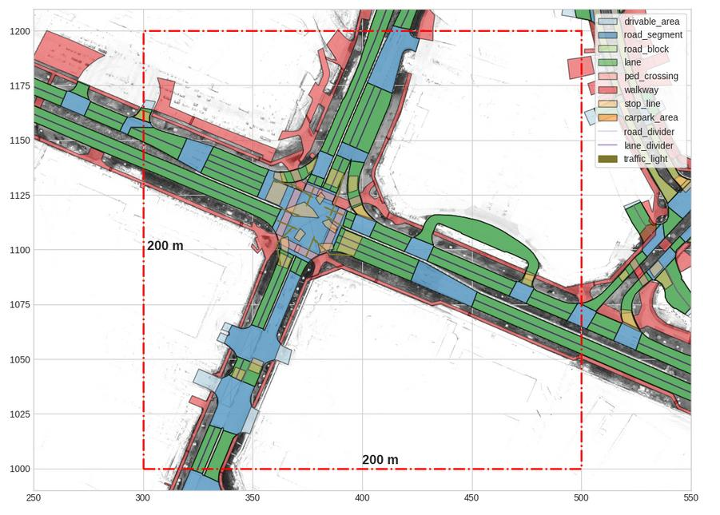

### 1.1 几何层

#### a. Node

地图数据库中最基本的几何记录，唯一直接包含空间坐标的节点。

```json
{
    'token': '2163fdc8-77fc-4c1c-a099-70bc5be9f9b7',
     'x': 994.6139837360693,
     'y': 1054.5199816348131
 }
```

#### b. Line

定义一条或多条线的线序列，因此由两个或多个节点组成。

```json
{
    'token': '19f89773-f466-4d21-a583-4a963e6fe042',
     'node_tokens': 
    	['ee2752d0-5fc9-495c-aa4b-fc24f703db1b',
          '48b2f4ea-9781-4cf2-82ff-624267be98d6',
          '9995a31d-089b-45f1-81ec-11925d17dbda']
}
```

#### c. Polygon

定义可能包含内部孔洞的多边形。每个多边形记录都包括一个外部边缘节点列表，以及构成（零个或多个）孔的节点列表。

```json
dict_keys(['token', 'exterior_node_tokens', 'holes'])
```

### 1.2 非几何层

#### a. Drivable Area

指汽车可以行驶的区域，不考虑行驶方向或法律限制。这是唯一一个记录可以由多个几何实体表示的层。

```json
{
    'token': 'c3e28556-b711-4581-9970-b66166fb907d',
     'polygon_tokens': [
         'fff7b0c9-1eaf-4988-afe3-e4e4607f85e3',
          'd235013d-2a07-4181-9862-c666b49a79b4',
          '0bbf311c-405d-433b-a097-7d9c292a9b87',
          'b4dfb634-2721-42d9-aa5d-0f8ec9a2fa31',
          'c4b4c925-6ddb-4e4b-a4ca-609e1ca626c2',
          'a60970c7-86cd-4169-ae9a-b9b51e4ec950',
          '1209379e-bc10-4d65-9fb1-0ee938032130'
     ]
  }
```

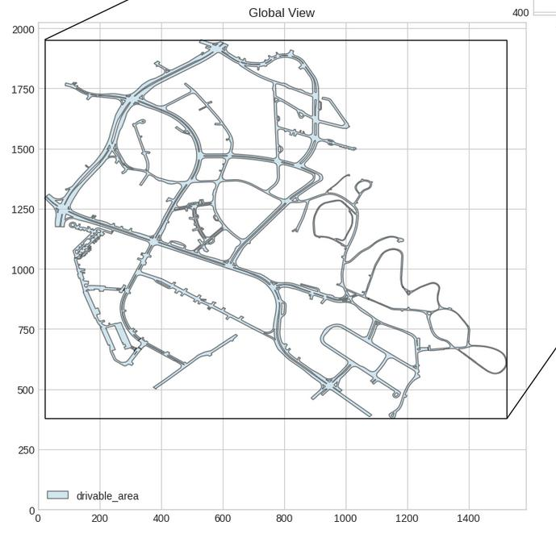

#### b. Road Segment

可行驶区域上的一段道路。它有一个`is_intersection`标志，表示特定路段是否为十字路口。它包含多个Road Block。一般来说，每个单独的车道线交汇区域，十字路口，普通车道区域都是单独的一个Road Segment。

```json
{
    'token': 'c366bb7b-1f3b-4840-b7d3-9d3362b02589',
 	'polygon_token': '254a099d-d884-4c5f-a444-d3703163f173',
	 'is_intersection': True,
	 'drivable_area_token': 'c3e28556-b711-4581-9970-b66166fb907d',
	 'exterior_node_tokens': [
         '15d4c84c-a459-492d-8fae-619c6eccb60c',
          '4e336b1e-b67c-4452-bad5-fedfb970fac4',
          '6060b6c9-26c8-4887-8b7d-0aa67404cd1a',
          '54305c13-60f8-4976-a555-8d915eb9ae4f',
          '6a2e3ae8-72c8-4605-a644-8c74b8454c98',
          'f9190d61-9d7a-46cb-9f6d-909f51f7565a',
          'eef9c998-204a-40f6-ad27-a600849e1b68',
          'bfa79595-ab08-46b5-ae1a-c66c57ebbe9f',
          '439fc8a3-c175-4511-99bf-e993a016c280',
          'bd2ca111-5da9-4e2d-b4c1-13cedb1f96ef',
          'a95821b5-a97e-401c-b96c-938037a8fbb0',
          '10d9a934-338a-413b-8835-f8ae1d9abb87',
          '61372da3-bed1-4524-bca4-26cb2f4d0f8e',
          '4f639960-ad63-40e2-a58f-2e7387a5c846'
     ],
 	'holes': []
}
```

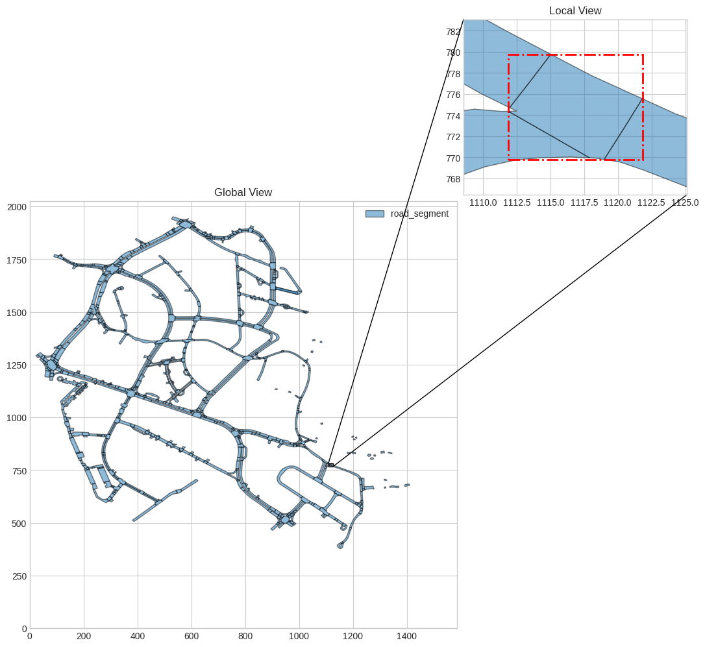

#### c. Road Block

Road Block是指具有相同交通方向的路段块，在一个Road Block内，车道的数量是一致的，即车道交汇处不属于Road Block。其中`from_edge_line_token`和`to_edge_line_taken`表示它们的交通方向。

```json
{
    'token': '002d8233-c9bf-4a9b-9d53-be86cd6cf73f',
     'polygon_token': '29fc4c78-75ae-4777-adab-f33d93591661',
     'from_edge_line_token': 'b0d2163e-732b-4be6-b6f7-2add8b4c7e8f',
     'to_edge_line_token': '7ce97362-1133-4c19-a73c-5cfa8f0d64f0',
     'road_segment_token': '85a06614-958c-461f-bc11-6cadd68efa7d',
     'exterior_node_tokens': [
         '46cf43f6-30ea-437e-83b3-42af3ce2783b',
          'aca16135-79a1-4acd-a68f-3918c38d54be',
          'ce31539b-d8c8-45a0-94df-3ac3a585225b',
          '26704699-79a6-4d4c-8ca2-d65ffb3ac11b',
          '2d0168af-7952-416d-8aff-7512130fb73d',
          'e3fa777d-d87a-45f9-bd41-5364e3bb9dd2',
          'bedec7db-1f55-4639-9826-ab8639ee250b',
          '05243627-6e25-472d-af1f-aca0ff30b00c'
     ],
    'holes': []
}
```

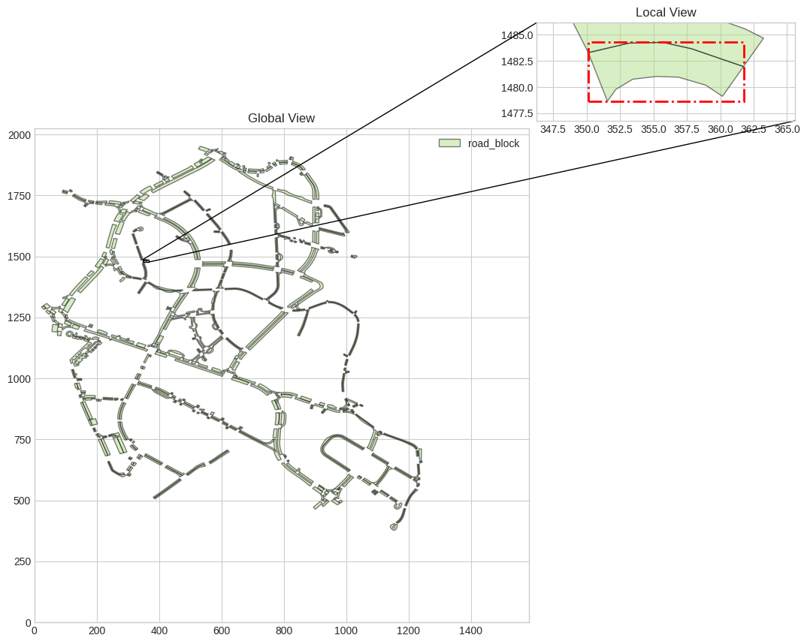

#### d. Lanes

指单个车道，包含区域和车道线。除了标记和几何表示之外，车道还有几个字段：  

+ `lane_type`：表示是否允许汽车或自行车通过该车道。  
+ `from_edge_line_token`和`to_edge_line_taken`：表示它们的交通方向。
+ `left_lane_divider_segments` 和 `right_lane_divider_segment`：表示车道线的划分；
+ `left_lane_divider_segment_nodes` 和 `right_lane_divider_segment_nodes`：车道线对应的节点；

```json
{
    'token': '027c1ffc-2d04-4190-8a42-2495210e9622',
     'polygon_token': 'b7aac1b3-9ebd-4ea3-a274-63aa048cd978',
     'lane_type': 'CAR',
     'from_edge_line_token': '7c0c8950-66cb-4d36-8f87-45a3188c1930',
     'to_edge_line_token': '901c9931-31f4-471c-b112-909277e5f678',
     'left_lane_divider_segments': [],
     'right_lane_divider_segments': [
           {'node_token': '0d96682e-0cf9-4e5c-a06b-8463d1f20144',
           'segment_type': 'DOUBLE_DASHED_WHITE'},
          {'node_token': '795d2b19-15db-42f5-b22e-878f841cb312',
           'segment_type': 'DOUBLE_DASHED_WHITE'},
          {'node_token': '795d2b19-15db-42f5-b22e-878f841cb312',
           'segment_type': 'DOUBLE_DASHED_WHITE'},
          {'node_token': 'b5c70d99-0f50-45c7-a5aa-d6375ae99441',
           'segment_type': 'DOUBLE_DASHED_WHITE'},
          {'node_token': 'b5c70d99-0f50-45c7-a5aa-d6375ae99441',
           'segment_type': 'DOUBLE_DASHED_WHITE'},
          {'node_token': '6b1f87e2-85d2-48b9-aef2-2b270ab33c10',
           'segment_type': 'DOUBLE_DASHED_WHITE'}
     ],
    'exterior_node_tokens': [
         '0d96682e-0cf9-4e5c-a06b-8463d1f20144',
          '795d2b19-15db-42f5-b22e-878f841cb312',
          'b5c70d99-0f50-45c7-a5aa-d6375ae99441',
          '6b1f87e2-85d2-48b9-aef2-2b270ab33c10',
          '7984b6f6-c414-448d-8a64-e40d26e8f8a2',
          '18f58931-f868-488e-8ac9-2128c083c04f',
          '9ad0d50c-d8ca-43f1-a58d-14f96c5d297d',
          '1d08ea57-9d1b-434b-be45-bd70d7fb407e',
          'e9be4146-fa7d-4e69-9475-8d0cebe1d09b',
          '332ca5a0-1d1d-4b9d-97ba-4baaef76ecdf',
          '8fbd9518-7196-49df-8a85-d02690b006ac'
    ],
     'holes': [],
     'left_lane_divider_segment_nodes': [],
     'right_lane_divider_segment_nodes': [
         {'token': '0d96682e-0cf9-4e5c-a06b-8463d1f20144',
           'x': 235.4636191341564,
           'y': 1487.6812004383337},
          {'token': '795d2b19-15db-42f5-b22e-878f841cb312',
           'x': 230.70450258395465,
           'y': 1477.5650873318937},
          {'token': '795d2b19-15db-42f5-b22e-878f841cb312',
           'x': 230.70450258395465,
           'y': 1477.5650873318937},
          {'token': 'b5c70d99-0f50-45c7-a5aa-d6375ae99441',
           'x': 227.40425987726465,
           'y': 1471.1668247268694},
          {'token': 'b5c70d99-0f50-45c7-a5aa-d6375ae99441',
           'x': 227.40425987726465,
           'y': 1471.1668247268694},
          {'token': '6b1f87e2-85d2-48b9-aef2-2b270ab33c10',
           'x': 225.01367660611905,
           'y': 1466.853384291782}
     ]
}
```

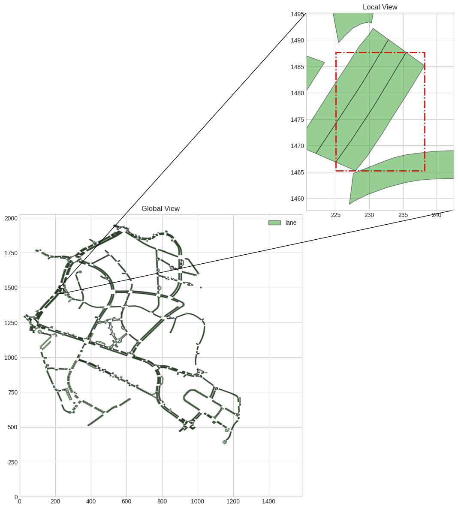

+ 备注：从图上可以看出，`right_lane_divider_segment_nodes`是指三车道（当前位置为左车道）中靠近中间车道的那根线，此时被标记为了`DOUBLE DASHED WHITE`类型。而`left_lane_divider_segment_nodes`由于为车道外边界，可以为空。

#### e. Pedestrian Crossing

每个人行横道记录都必须在一个road_segment上。

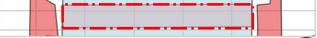

#### f. Walkway

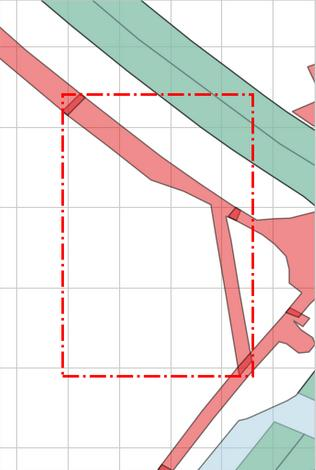

#### g. Stop Line

停止线不是单纯的一条线，而是一个区域。几个属性如下：

+ `stop_line_type`，停止线的类型，这表示自车停止的原因
  + 如果`stop_line_type`是ped_crossing，则ped_crossing_tokens表示关联信息。
  + 如果`stop_line_type`是traffic_light，则traffic_light_tokens表示关联信息。

+ `road_block_token`表示与road_block的关联信息，默认情况下可以为空。
+ `cues`提示字段包含为什么此记录是stop_line的原因。
  + `stop_line_type`为`PED_CROSSING`或`TURN_STOP`：`PED_CROSSING`记录。
  + `stop_line_type`为`TRAFFIC_LIGHT`：`TRAFFIC_LIGHT`记录。
  + `stop_line_type`没有显示：`STOP_SIGN`或`YIELD`。

```json
{
    'token': '00904b8f-3166-47b8-9cbb-30062caec0eb',
     'polygon_token': '90102f73-9921-4d2a-8e07-148503868957',
     'stop_line_type': 'TURN_STOP',
     'ped_crossing_tokens': ['96748923-eabf-4142-8458-92ff580e997f'],
     'traffic_light_tokens': [],
     'road_block_token': '',
     'exterior_node_tokens': [
         'a3e110de-2443-406f-bf54-ef9b4dc46939',
          'e5d038c8-f964-4ae2-b498-9952496c801f',
          'bbec1377-0e20-4888-9f79-2a1aa50b3b88',
          '37a078fa-2804-412e-b8b9-682fe21ad8be',
          '50597561-e04f-4ea1-894a-cfd2c212aef0',
          'b05b2d23-3a12-493d-9d8d-e57f4f8ddc60'
     ],
     'holes': [],
     'cue': [
         {
              'token': '96748923-eabf-4142-8458-92ff580e997f',
               'polygon_token': 'f8a39c38-1d04-4dc0-9e35-f63966e56250',
               'road_segment_token': '6ea9d0a6-65e7-4038-ae50-4fb89a4c296d',
               'exterior_node_tokens': [
                   '7931be00-b6a7-437d-9335-e4314dbe47b4',
                    '1f6f7c4a-27a2-4a18-96bd-fe597546440f',
                    'a28f6633-a23e-44f6-8355-0c06df42005e',
                    '235431b5-9f71-452d-a3b2-bdeaaa44aa41'
               ],
       			'holes': []
         }
     ]
}
```

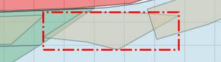

```json
{'token': '009cf7f7-b428-49e8-976a-2507bdf24cc3',
 'polygon_token': '0430a2e0-5fe7-4a97-be7f-f86369adb4c1',
 'stop_line_type': 'TRAFFIC_LIGHT',
 'ped_crossing_tokens': [],
 'traffic_light_tokens': ['182079de-ffeb-48fe-a9a4-ae1ed0870714',
  '51edd45a-b57a-496e-96b0-7c649e4831ed',
  'cc19ad44-15c8-4cea-bf71-c1023cc1b280',
  '589e639e-81aa-4ff1-be26-c5b36d04e5c6'],
 'road_block_token': 'fcf80474-21be-44b5-93d4-b05cc2864280',
 'exterior_node_tokens': ['456ccdac-4574-41cc-9deb-8fab5a0c4fe1',
  'b953889d-fb23-412d-9942-811acdfb13e7',
  '64cd662e-f773-4e1f-a4e9-b1bcaa7cfe0b',
  '6410fa98-2ab8-4bb5-8301-272dae82a33f'],
 'holes': [],
 'cue': [{'token': '182079de-ffeb-48fe-a9a4-ae1ed0870714',
   'line_token': 'b37d6082-1411-4472-81fe-dd0ab685aebf',
   'traffic_light_type': 'VERTICAL',
   'from_road_block_token': 'fcf80474-21be-44b5-93d4-b05cc2864280',
   'items': [{
         'color': 'RED',
         'shape': 'CIRCLE',
         'rel_pos': {'tx': 0.0, 'ty': 0.0, 'tz': 0.632,
          'rx': 0.0, 'ry': 0.0, 'rz': 0.0},
     'to_road_block_tokens': []},
    {
        'color': 'YELLOW',
         'shape': 'CIRCLE',
         'rel_pos': {'tx': 0.0, 'ty': 0.0, 'tz': 0.381,
          'rx': 0.0, 'ry': 0.0, 'rz': 0.0},
     'to_road_block_tokens': []},
    {
    	'color': 'GREEN',
         'shape': 'CIRCLE',
         'rel_pos': {'tx': 0.0, 'ty': 0.0, 'tz': 0.13,
      	 'rx': 0.0, 'ry': 0.0, 'rz': 0.0},
     'to_road_block_tokens': []},
    {
    	'color': 'GREEN',
    	 'shape': 'RIGHT',
 	    'rel_pos': {'tx': 0.0, 'ty': 0.0, 'tz': 1.013,
      	 'rx': 0.0, 'ry': 0.0, 'rz': 0.0},
     'to_road_block_tokens': ['55f41c40-a21e-4327-81e4-c917a5cdbd99']
     }],
   'pose': {
   		'tx': 958.2618775229023, 'ty': 529.8639085371688, 'tz': 2.4,
    'rx': 0.0, 'ry': 0.0, 'rz': 0.8821014950754016},
   'node_tokens': [
   	'b4c65f93-d0dd-48c3-a131-a5f14c22d9de',
    '3e3eb7c8-5d1a-47b6-959d-73e6a47a5dec']},
// 下略
```

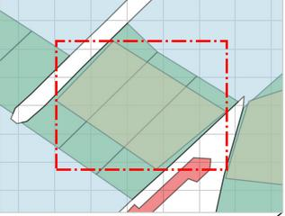

#### h. Carpark Area

 它有几个属性：  

+ `orientation`以弧度表示停放汽车的方向。  

+ `block_token`表示与`road_ block`的关联信息。  

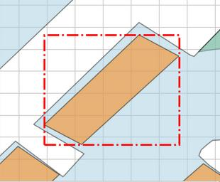

#### i. Road Divider

一个`road_ block`与另一个`road_ block`的边界，包含`road_segment_token`的关联信息。

```json
{
    'token': '00bbfc65-0b44-4b4c-b517-6d87dc02529c',
     'line_token': '98c91318-5854-41ac-9210-001b57b8185f',
     'road_segment_token': 'b1ed2f76-bfcd-4b0c-b367-7a20cf707b95',
     'node_tokens': [
         '4e2605d4-b9f4-41f9-a03c-032c8d4a3c24',
     	 '1cbbdda6-5ee6-4b4d-8bcc-30af18094978'
     ]
}
```

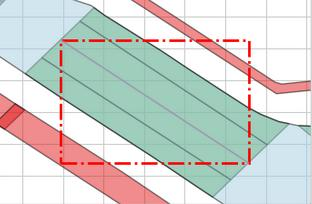

#### j. Lane Divider

车道分隔带位于指向同一交通方向的车道之间。其中`lane_divider_segments`字段，由不同的`node`及其各自的`segment_type`组成，其中`segment_types`表示它们的物理外观。如下示例，该线条有四个点表示。

```json
{
    'token': '00569b72-a7dc-4cdf-9bf3-7f3583c6dbae',
     'line_token': '9ac741dc-20b5-44f3-9f0a-41e371a722ee',
     'lane_divider_segments': [
          {
             'node_token': '57d546eb-682c-4540-871c-2e8d6a67f2de',
       		 'segment_type': 'DOUBLE_DASHED_WHITE'},
          {
              'node_token': 'fef2c634-7096-4b48-bf87-6575d2a67b56',
              'segment_type': 'DOUBLE_DASHED_WHITE'},
          {
              'node_token': '153990f1-b0da-4243-a065-e4a99d29e180',
              'segment_type': 'DOUBLE_DASHED_WHITE'},
          {
              'node_token': '8ad3000f-c1e9-4eda-8bf1-c5f64a879c54',
              'segment_type': 'NIL'
          }
     ],
     'node_tokens': [
         '57d546eb-682c-4540-871c-2e8d6a67f2de',
          'fef2c634-7096-4b48-bf87-6575d2a67b56',
          '153990f1-b0da-4243-a065-e4a99d29e180',
          '8ad3000f-c1e9-4eda-8bf1-c5f64a879c54'
     ]
}
```

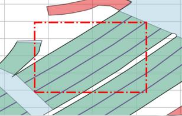

#### k. Traffic Light

它有几个属性：

+ `traffic_light_type`表示红绿灯是水平定向还是垂直定向。

+ `from_load_block_tokens`表示红绿灯引导从哪个道路阻塞。

+ `items`是红绿灯的灯泡。

+ `pose`表示红绿灯的姿态。

```json
{'token': '00590fed-3542-4c20-9927-f822134be5fc',
 'line_token': '5bffb006-bce8-44a4-a466-5580f1d748fd',
 'traffic_light_type': 'VERTICAL',
 'from_road_block_token': '71c79c48-819c-4b17-ad28-2a9e82ba1596',
 'items': [{'color': 'RED',
   'shape': 'CIRCLE',
   'rel_pos': {'tx': 0.0,
    'ty': 0.0,
    'tz': 0.632,
    'rx': 0.0,
    'ry': 0.0,
    'rz': 0.0},
   'to_road_block_tokens': []},
  {'color': 'YELLOW',
   'shape': 'CIRCLE',
   'rel_pos': {'tx': 0.0,
    'ty': 0.0,
    'tz': 0.381,
    'rx': 0.0,
    'ry': 0.0,
    'rz': 0.0},
   'to_road_block_tokens': []},
  {'color': 'GREEN',
   'shape': 'CIRCLE',
   'rel_pos': {'tx': 0.0,
    'ty': 0.0,
    'tz': 0.13,
    'rx': 0.0,
    'ry': 0.0,
    'rz': 0.0},
   'to_road_block_tokens': []},
  {'color': 'GREEN',
   'shape': 'RIGHT',
   'rel_pos': {'tx': 0.0,
    'ty': -0.26,
    'tz': 0.13,
    'rx': 0.0,
    'ry': 0.0,
    'rz': 0.0},
   'to_road_block_tokens': ['bd26d490-8822-469b-ae60-74f6c0c9e1cb']}],
 'pose': {'tx': 369.2207339994191,
  'ty': 1129.3945093980494,
  'tz': 2.4,
  'rx': 0.0,
  'ry': 0.0,
  'rz': -0.6004778487509836},
 'node_tokens': ['8e483ef5-75e5-417a-bc78-fa7750297fb1',
  '78a4b686-3207-48fa-ae2a-d5f875e0ee37']}
```

## 2. 代码使用

1. 引用地图元素

   ```python
   from nuscenes.map_expansion.map_api import NuScenesMap
   from nuscenes.map_expansion import arcline_path_utils
   from nuscenes.map_expansion.bitmap import BitMap
   
   nusc_map = NuScenesMap(dataroot='/home/idriver/learning/', map_name='singapore-onenorth')
   ```

   
