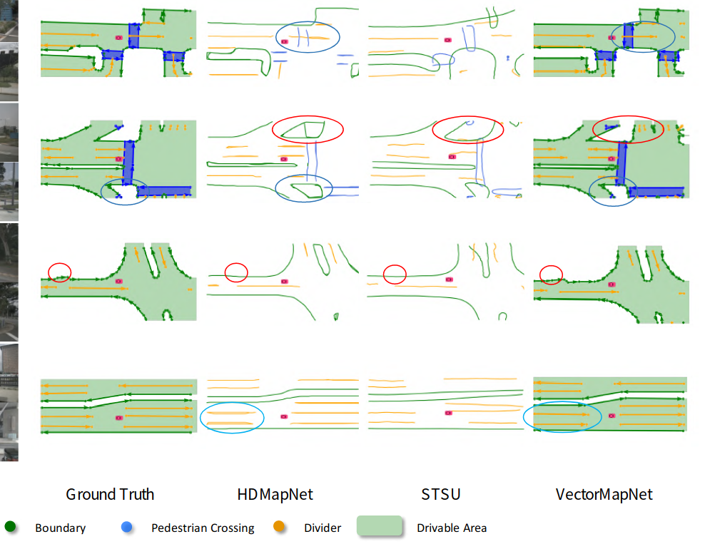

## 在线高精算法论文阅读笔记

[TOC]


### HDMapNet: An Online HD Map Construction and Evaluation Framework

1. 参考文档：
   + 论文：https://www.cnblogs.com/xiaoliu-ya/p/16553462.html
   + 代码：https://github.com/Tsinghua-MARS-Lab/HDMapNet/tree/main

2. 参考笔记的补充：

   + 关于语义预测：很普通的FCN加上交叉损失熵函数；
   + 关于实例预测：
     + 损失函数详见Lanenet。有点疑惑这种依赖参数的表示方式会不会鲁棒性比较差？
     + $C(C-1)$是组合数公式去掉了系数；
   + 关于方向预测：
     + 理解为转换为一个二分类问题，这里其实可以参考环形标签（旋转目标检测）论文来改进方向；
     + 地图上的大多数像素都不位于车道上，这意味着它们没有方向。 这些像素的方向向量是零向量。作者不在训练期间对这些像素进行反向传播。
   + 关于向量化： 在推断过程中，首先使用基于密度的带噪声应用空间聚类 (DBSCAN) 对实例嵌入进行聚类。然后使用非极大值抑制来减少冗余。最后，利用预测的方向贪婪地连接像素，得到向量表示。

3. 代码原理补充：

   + 关于批量标准化图像：

     正向标准化的方程为：$ z = (x - \text{mean}) / \sigma $，因此有：
     $$
     \begin{aligned}
     x &= z * \sigma + \text{mean} \\
       &= (z + \text{mean}/\sigma) * \sigma \\
       &= \left(z - \left(-\text{mean}/\sigma\right)\right) / (1/\sigma) \\
       &= (z - \text{mean}^{-1} )/ \sigma^{-1} \\
      \end{aligned}
     $$
     这解释了代码：

     ```python
     class NormalizeInverse(torchvision.transforms.Normalize):
         #  https://discuss.pytorch.org/t/simple-way-to-inverse-transform-normalization/4821/8
         def __init__(self, mean, std):
             mean = torch.as_tensor(mean)
             std = torch.as_tensor(std)
             std_inv = 1 / (std + 1e-7)
             mean_inv = -mean * std_inv
             # super()：通常在子类中使用，用于在子类中调用父类的方法或属性
             super().__init__(mean=mean_inv, std=std_inv)
     
         # __call__：可以使得方法变成可被调用对象
         def __call__(self, tensor):
             return super().__call__(tensor.clone())
     ```
     
   + 更多内容详见代码笔记文件夹

### VectorMapNet: End-to-end Vectorized HD Map Learning

1. 论文核心点：

   + 与HDMapNet相比，采用了端到端而非HDMapNet中的几何后处理方案，直接输出矢量化而非栅格地图；
   + 使用DETR来检测出关键点，再直接利用生成器矢量化为polyline，以适应地图元素的异构性；

2. 补充信息：

   + Ramer-Douglas-Peucker (RDP) 算法：将曲线用尽量少的点采样成折线的算法

   + Teacher forcing：在训练时，将真实的目标序列作为解码器的输入，而不是将解码器自身生成的序列作为下一时刻的输入；这样可以使模型更容易学习到正确的序列生成方式，但是 open-loop 模式下，模型在训练时和测试的输入会有较大差异，因此通常会在训练过程中随机地使用Teacher Forcing或自回归的方式来训练模型

   +  Fréchet 距离：用于度量两个路径之间相似性的概念。对于两个离散点集 $P=\{p_1,p_2,...,p_N\}$ 和 $Q=\{q_1,q_2,...,q_M\}$，Fréchet距离定义为：
     $$
     \begin{aligned}
     D(i,j) &= ||p_i - q_j||\\
     L(i,j)&=\max\left(D(i,j), \min\left( L(i−1,j), L(i,j−1), L(i−1,j−1) \right) \right) \\
      F(P,Q)&=L(n,m)
      \end{aligned}
     $$

     直观理解Fréchet distance就是：主人走路径A，狗走路径B，各自走完这两条路径过程中所需要的最短狗绳长度。[参考链接](https://blog.csdn.net/qq_40206371/article/details/130039377)

   + Chamfer 距离：用于度量两个点云之间相似性的距离度量。给定两个点云，Chamfer 距离衡量了将一个点云变形到另一个点云所需的最小平均平方距离：
     $$
     \text{Chamfer}(X,Y)=\frac{1}{m}\sum_{i=1}^{m} \min_{j} \| x_i - y_j \|^{2}+\frac{1}{n}\sum_{j=1}^{n} \min_{i} \| y_j - x_i \|^{2}
     $$

   + 多种IoU损失函数总结：https://zhuanlan.zhihu.com/p/388622389

3. 一些没有太理解的点：

   + 注意到元素关键点不同于多段线顶点，元素关键点是VectorMapNet的中间表示，每一类polyline生成的关键点数目恒定；
   + 为什么VectorMapNet 比HDMapNet 性能提高这么多？什么是问题的核心？

4. 实验结果中的比较关键的点：

   + 模型细节：

     + 在不知道地平面精确高度的情况下，这种单应性并不是精确的变换。为了缓解这个问题，在实际中我们将图像特征转化为4个不同高度的BEV平面( 我们用 - 1m , 0m , 1m , 2m )

   + 结论：

     + 向量化的优势：VectorMapNet可以保留尖锐的角点，而 polyline 表示避免了 VectorMapNet 生成模糊的自环绕结果（因为它一致地编码方向信息。相比之下，栅格的方法容易产生虚假循环曲线）。

       

     + 文中性能提高的原因分析：归因于模型对地图要素之间拓扑关系的建模能力，从而隐式地捕捉复杂的场景相互关系。

     + 当自车摄像头被附近车辆遮挡时，VectorMapNet ( Camera )无法感知周围地图。利用LiDAR的深度信息，Vector Map Net ( Fusion )可以得到比相机更可信的结果。

     + polyline采样：第一种，在曲率变化超过一定阈值的位置对顶点进行采样。第二种，是以固定间隔( 1m )对顶点进行采样。结果基于曲率的采样方法大大优于固定采样方法。这是因为固定采样方法涉及大量的冗余顶点集合，这些顶点对几何结构的贡献可以忽略不计，因此在学习过程中低估了基本顶点（例如,折线拐角处的顶点）。

   + 扩展：

     + 使用VectorMapNet来预测中心线：将中心线视为多条线的集合，并隐式地编码它们的拓扑关系。
     + 扩展思考：[为什么要设计两层query呢？](https://www.sohu.com/a/689845043_560178)

5. 文章的缺陷：

   + 缺乏时间信息：模型在单帧中生成一致的几何图形，但不能保证预测的时间一致性；
   + 两阶段模型的失配问题：由于教师强制训练策略，地图元素检测器和折线生成器之间存在特征空间失配。虽然微调对于优化性能是必要的，但它会导致棘手的训练计划；
   + 幻觉能力：模型可以在被遮挡且摄像头不可见的位置进行预测，显示其场景理解能力。然而，这降低了模型的可解释性。
   + 地图要素的点虽然是有序的,但起点不是唯一的：MapTR解决的问题。
   + 较难推理和部署：利用自回归解码器顺序预测点，导致较长的推理时间（生成过程是序列性的,只能做到多个instance的并行,instance内部无法并行,降低了效率）。同时，直接推理到矢量化需要大量数据，很难收敛；

### MapTR: Structured Modeling and Learning for Online Vectorized HD Map Construction

1. 参考文档：

   + https://zhuanlan.zhihu.com/p/671394052

2. 论文核心点：

   + 点集建模：采用`permutation-equivalent`（排列等价）方法：

     + 点集主要分成了两种，包括Polygon和Polyline。Polygon主要就是包含起点和终点的一个顺序，Polygon要复杂点，包括了顺时针和逆时针的各种组合的闭环。
     + MapTR将预测闭环的索引映射到不同的排列中，从而形成一组等效的多边形表示；
     + 这种排列的目的是使得模型在处理排列敏感的多边形数据时能够不受排列顺序的影响，从而减少学习过程中的歧义，使得模型能够更容易、更稳定地学习到正确的多边形表达。统一地对地图元素进行建模，解决了模糊性问题。

   + 网络的真值**匹配**（即训练阶段匈牙利匹配）：和query的设计相同，也采用分层匹配方法，将地图元素集合视为固定大小，依次进行实例级匹配和Point-level匹配。

     + 实例级别的配对采用匈牙利最优匹配，通过类别约束（采用Focal Loss）和位置约束来筛选的；
     + 完成实例匹配后，每个实例中Point-level的配对是通过：预测点与真值等效点集的Manhattan距离约束来筛选的。

   + 网络的训练**损失**：

     + 分类损失：根据实例级的最佳匹配结果，采用Focal Loss预测类别标签；

     + 点对点的损失：根据点级最优匹配结果，采用Manhattan Loss预测每个点的位置；后续实验表明，point2point配对优于Chamfer距离代价；

     + 边缘方向损失：点对点损失只限制了折线和多边形的节点点，没有考虑边缘（相邻点之间的连接线），因此采用成对的预测边缘$ (\hat{e}_{\hat{\pi}(i),j})$ 和 GT 边缘$ (e_{i,\hat{\gamma}_i(j)})$ 的余弦相似度以限制较高边缘层次的几何形状：
       $$
       \mathcal{L}_{dir} = -\sum ^{N −1} _{i=0} \mathbb{1}_{\lbrace c_i \neq \varnothing \rbrace} \sum ^{N_v −1} _{j=0} \rm{cosine\_similarity}(\hat{e}_{\hat{\pi}(i),j},e_{i,\hat{\gamma}_i(j)}) \\
       
       \hat{e}_{\hat{\pi}(i),j} = \hat{v}_{\hat{π}(i),j} − \hat{v}_{\hat{π}(i),(j+1)\mod N_v} , \tag9  \\
       
       e_{i,\hat{\gamma}_i(j)} = v_i,\hat{\gamma}_{i(j)} − v_{i,\hat{\gamma}_i(j+1)\mod N_v} .
       $$

   + 是一种端到端的实时矢量化方案；

   + MapTR还测试了对外参波动的容许度：

     + 角度偏差：0.02rad；平移偏差：0.1m；
     + 但是过大的偏差对性能影响会比较大；

3. 补充细节：
   + Focal Loss：通过在标准交叉熵损失的基础上新增一个系数因子，从而减弱对容易样本的学习和加强对困难样本的学习，提高模型的分类能力。[参考链接](https://zhuanlan.zhihu.com/p/639004674?utm_id=0)
   + Cosine Similarity：余弦相似性工具，主要判断角度变化；[参考链接](https://zhuanlan.zhihu.com/p/628061833)
   + Deformable Attention：[参考链接](https://blog.csdn.net/qq_23981335/article/details/129123581)
4. 一些没有理解的点：
   + MapTR对真值数据进行均匀采样（20个点，实验达到最好的性能，进一步增加点数会增加优化难度，导致性能下降），而非VectorMapNet 推崇的在曲率变化超过一定阈值的位置对顶点进行采样。不清楚为什么采用这个方案；

### MapTRv2: An End-to-End Framework for Online Vectorized HD Map Construction

1. 论文核心点：
   + 为了加快收敛速度，在训练时增加了一对多的辅助匹配分支，以增加正向样本数量：
     + 将真值的地图元素复制k份，地图元素数量增加至 T，因此一个真值地图元素可以匹配k个预测的地图元素。在训练时增加了正样本数量，使得decoder收敛更快。
   + 在透视视图和鸟瞰视图上引入辅助前景分割，并利用深度监督来引导骨干学习三维几何信息；
     + 为了显式地利用深度信息，BEV转换模块由GTK变为了LSS-based BEVPoolv2；
     + QUS：车道线或者道路标识线加入深度监督真的有意义吗？收益比如何呢？
   + 引入了为分层查询机制量身定制的解耦自注意力，极大地减少了内存消耗并带来了增益；
     + MapTR采用的自注意力机制使层次查询之间进行信息交换(既有实例间的,也有实例内的)，计算复杂度较大：点的数量是固定的，但随着实例数的增加，其消耗的内存资源也是逐步增加的；
     + MapTRv2中解耦self-attention，即分别在inter-ins（实例内）和intra-ins（实例外）进行attention操作：后续实验表示，实例自注意力在很大程度上减少了训练内存，同时以可忽略的精度损失为代价。增加实例内的交互后少量增加训练内存，少量增加精度；
   + 提出三种cross-attention方式，分别是基于bev的  cross-attention、基于pv的cross-attention和两者结合的cross-attention：
     + 基于bev的 cross-attention 和 maptr 中的一样，消融实验表明在nus. 2D数据集中表现最佳，帧率相较于pv方法下降不多；
     + 基于pv的 cross-attention，得到预测的参考点集后，在投影到前视图上采集各点周围的特征值；
     + 两者结合的 cross-attention，就是将结合上述两种方式的attention方法，消融实验表明av2. 3D数据中表现最佳，但是帧率有明显的下降。
2. 相关文献：
   + PolyDiffuse：在MapTR中引入扩散机制，通过条件生成过程进一步精化结果；
   + MapVR：将可微的栅格化应用于MapTR产生的矢量化结果，以纳入精确和几何感知的监督；
3. 补充细节：
   + 自注意力机制的图示：[参考链接](https://blog.csdn.net/qq_41129489/article/details/127362272)
4. 疑惑：
   + 似乎对外参的容忍度从v1的0.02rad下降到了0.01rad（0.5°）

### PivotNet: Vectorized Pivot Learning for End-to-end HD Map Construction

1. 论文核心点：
   + 在集合预测框架中采用基于支点/枢纽点（Pivot-Based）表示对地图元素进行精确建模：
     + MapTR固定每种元素的方法导致信息丢失，特别是对于圆角和直角，平滑性也较差；而VectorMapNet采用的由粗到细及自回归方法，会导致较长的推理时间和累积误差；
     
       
     
     + 将矢量化后的点集 S 按对地图要素形状的贡献分为：枢纽点序列Sp，和共线点序列Sc。枢轴序列由一组有序的枢轴点组成，这些枢轴点对整体形状有贡献，并且通常表示地图元素中方向的变化（具体挑选方式没有看懂）；
     
   + 点线掩码模块（point-to-line mask module）：
     + 输入：首先BEV特征输出经过`Line-aware Point Decoder`，得到点的描述子$\{Q_{m,n}\}^{M,N}_{ m=1,n=1}$​​，这里M是实例的最大个数，N是实例中点的最大个数。
     
     + 输出：多个线级别的有序点集，即属于若干组不同实例的有序总点集$\hat{S}$；
     
     + 功能：同时编码从属关系和几何关系，强制对同一实例的点查询学习一个共享的线感知注意力掩码。
     
     + 方法：将同属相同地图元素(index m一致)的query进行concat，输入至共享权重的MLP中进行编码，得到line features，随后与BEV特征进行叉乘，得到Line-aware掩码（这个掩码应该理解为：在BEV Feature上的一个二分类结果）。将线掩码融入到交叉注意力层中，通过共享或不同的线级掩码对从属关系进行隐式编码（并使其仅关注车道线部分）。
     
     + 损失函数：为了保证有意义的线特征并约束几何关系，引入线感知损失$\mathcal{L}_{LA}$，其表达式为：
       $$
       \mathcal{L}_{LA} = \mathcal{L}_{bce}(\hat{M}_{\text {line}}, {M}_{\text {line}}) + \mathcal{L}_{dice}(\hat{M}_{\text {line}}, {M}_{\text {line}})
       $$
     
     + 实验：仅使用PLM模块提高性能9个点左右；此外，层级的index错误会极大的放大精度损失，但是现有的PLM不会造成这种现象，因此相比较层级化的查询方式，实验表明mAP提供了4个点左右；
     
   + 支点动态匹配模块（pivot dynamic matching module）：通过引入序列匹配的概念，对动态点序列中的连接进行建模

     + 匹配的目标：真值的有序枢纽点集$S_p$（大小为T）和预测的有序总点集$\hat{S}$（大小为N）进行匹配，如果采用匈牙利匹配算法，则算法复杂度为$O(C^T_N)$。采用基于动态规划算法可以进行优化到$O(NT)$。

     + 具体而言，首先固定首末两个端点，之后视为一个dp问题，有：
       $$
       dp[i][j] = \min_{k∈[1,j−1]} dp[i − 1][k] + ||v_i − \hat v_j||_1
       $$

     + 实验：仅使用PDM模块，性能提高了7个点左右；但这种比较没有太大意义，应该和匈牙利算法比较；

   + 动态向量化序列损失（dynamic vectorized sequence loss）：

     + DVS损失包括三个主要部分：包括枢轴点监督、共线点监督和枢轴分类损失。
     + 枢轴点监督：枢轴点$\hat S_p$损失约束与真值序列$S_p$之间的L1距离。
     + 共线点监督：
       1. 对于两个枢轴点间的共线点可以表示为：$C_{n,r} = (1 − θ_{n,r})S^p_n + θ_{n,r}S^p_{n+1}$​
       2. 其中系数$θ_{n,r} = r/(R_n + 1). R_n$是共线点的数量；
       3. 损失表示为：$\mathcal L_{cp} = \frac{1}{N −T}\sum^{T −1}_{n=1}\sum^{R_n}_{r=1}\|\hat C_{n,r} −  C_{n,r}\|_1$​
     + 枢轴分类监督：采用二元交叉熵损失来监督预测点成为枢纽点的概率。

2. 补充细节：

   + 关于dice loss损失：https://www.python100.com/html/JBCB4N963S24.html。
     + 优势：Dice Loss适用于像素数量不平衡的情况和目标较小的情况。它比传统的交叉熵损失函数更加适用于图像分割任务。
     + 不足：Dice Loss不考虑类别之间的距离和区别，因此不能很好地区分相似的像素值。同时，Dice Loss的函数形式很复杂，在比较大的分割任务中需要较长的时间计算。

3. 一些疑惑：

   + 点线掩码模块直接得到点的顺序，这个怎么监督的？
   + 预测地图范围定义为车辆前后30m和左右15m，这个是不是有点太近了些？

### LATR: 3D Lane Detection from Monocular Images with Transformer

基于Transform的3D车道线检测方案，暂时跳过

### TopoNet：Graph-based Topology Reasoning for Driving Scenes

1. 论文核心点：

   + 提出一种拓扑推理网络，以端到端的方式预测驾驶场景拓扑。TopoNet由两个分支组成，分别为交通要素和中心线，且具有一个共享的特征提取器。

     + 中心线与物理地图要素的一个关键区别：中心线天然地编码车道拓扑结构和交通规则，不能仅从局部特征推断。
     + 由于SOTA地图学习方法MapTR采用排列等价建模，忽略了中心线的方向，因此其在拓扑度量指标上的性能显著退化。没有方向信息的中心线查询的性能表明，理解复杂场景和感知呈现的实例是两个完全不同的故事。
     + InstaGraM通过先预测顶点，然后利用GNN模块检测边，将地图元素构建为图。其GNN同时产生所有顶点特征，导致缺乏实例级交互；
     + TopoNet则利用图神经网络的实例级特征传输，从拓扑图中的其他元素中提取显著的预测线索。

   + Scene Graph Neural Network，SGNN

     + 采用嵌入网络在统一的特征空间中提取交通要素知识（Embedding Network）：透视视角下检测的部分交通要素（指示牌等）需要投影到统一视角下，公式如下，其中i为第i个解码器层。但是含义和实现方式有点没看懂：
       $$
       \hat{Q}^i_t = \text{embedding}_i({Q}^i_t)
       $$

     + Feature Propagation in GNN：将框架中的所有实体建模为图中的顶点，并通过图神经网络加强感知实例之间的相互联系，以学习它们之间的内在关系。

       为了保证交通要素和车道线要素统一，需要引入一个适配器层，将这种异构信息结合：

       

     + SGNN的先验拓扑知识设计：

       1. 在有向图中，消息是单向传递的，但是由于车道的结构是相互依赖的，车道的位置可以很好地指示其邻居的位置。因此，我们用一个向后邻接矩阵（$A^{i-1}_{ll}$）来链接两个连通的中心线，以进行消息交换。

          车道线间的权重矩阵的设计如下。其中I表示自环的全同映射，$β_{ll}$是一个超参数，用来控制节点间传播的特征比例。
          $$
          T^0_{ll} = I,\\
          T^i_{ll} = β_{ll}  \cdot (A^{i−1} _{ll} + \text{transpose}(A^{i−1} _{ll})) + I
          $$

       2. 利用交通要素的特征，通过权重设计，对中心线embedding进行如下精化：
          $$
          T^0_{lt} = \mathbf0,\\
          T^i_{lt} = β_{lt} \cdot A^{i−1}_{lt},
          $$

       3. 在获得权重矩阵后，SGNN利用图卷积层( GCN ) 进行查询之间的特征传播；
          $$
          Q^{i′}_l = \text{GCN}^{i}_{ll} (Q^i_{l}, T^i_{ll}) ,\\
          Q^{i′′}_l = \text{GCN}^{i}_{lt} (Q^i_{l},\hat Q^i_{t}, T^i_{lt}).
          $$

     + SGNN的场景知识图谱设计：

       1. 先验拓扑知识中节点的语义仍未被探索。例如，来自交通元素指示直行的信息对红灯并不同等重要。因此，带有索引x的中心线查询根据其对应的交通元素的分类分数来聚合信息：
          $$
          \begin{aligned}
          K_{l t}^i & =A_{l t}^{i-1}, \\
          Q_{l_{(x)}}^{i^{\prime \prime}} & =\sum_{\forall y \in N(x)} \sum_{\forall c_t \in C_t} \beta_{l t} \cdot S_{t_{\left(c_t, y\right)}}^i K_{l t_{(x, y)}}^i \mathbf{W}_{l t_{\left(c_t\right)}}^i \widetilde{Q}_{t_{(y)}}^i,
          \end{aligned}
          $$
          其中$N_{(x)}$输出索引为x的顶点的所有邻居的索引，$S^i_t\in \R^{|C_t|\times| Q^i_t |}$表示交通元素查询的分类分数。

       2. 虽然所有中心线都属于同一类别，但考虑到车道线的有向连接性质，仍然会对特征传播过程产生影响。为此，将车道图的可学习权重矩阵表示为：$W^i_{ll}\in \R^{| C_l | × F_l × F_l} $，其中$C_l$​= { successor, predecessor, self-loop}。中心线查询进一步更新为：
          $$
          K^i_{ll} = \text{stack} (A^{i−1}_{ll}, \text{transpose}(A^{i−1}_{ll}), I)\\ Q^{i^′}_{l_{(x)}} = 
          	\sum_{∀y\in N_{(x)}} 
          	\sum_{∀c_l \in C_l} 
          	β_{ll} \cdot K^i_{ll_{(c_l,x,y)}} \mathbf{W}^i_{ll_{(c_l)}} Q^i_{l_{(y)}} .
          $$

       3. 由于图的稀疏性，样本分布存在严重的不平衡，为此在拓扑推理中使用了Focal loss

     + 对比实验：

       1. 将SGNN模块降级为MLP，将网络转化为没有特征传播的基线，拓扑推理的监督只发生在最后的解码器层。级联和下采样操作，以及流量元素嵌入也被去除。这种情况下貌似下降的不多？下降了一个点左右，但是不清楚这个拓扑的点一个点到底多大；
       2. 去掉TE部分或者模块精度掉了0.5个点。

   + 拓扑推理的衡量标准（Reasoning Metrics）：

     + TOP score是一种适应于图域的mAP度量。具体来说，给定一个真实图$G = (V,E)$和一个预测图$ G = (\hat V,\hat E)$，它在顶点上建立一个投影，使得$V=\hat V^′ ⊆ \hat V ,$，其中Fréchet 距离和IoU距离分别用于车道中心线和交通元素之间的相似性度量。在预测的( V′)内部，如果边的置信度大于0.5，则认为两个顶点是连通的。则TOP score为所有顶点$(V,E)$和$(\hat V,\hat E)$之间的平均顶点mAP：
       $$
       \mathrm{TOP}=\frac{1}{|V|} \sum_{v \in V} \frac{\sum_{\hat{n}^{\prime} \in \hat{N}^{\prime}(v)} P\left(\hat{n}^{\prime}\right) \mathbb{1}_{condition}\left(\hat{n}^{\prime} \in N(v)\right)}{|N(v)|}
       $$
     
     + OpenLane-V2 Score：详见官方说明 [doc](https://github.com/OpenDriveLab/OpenLane-V2/blob/master/docs/metrics.md#openlane-topology)

2. 补充细节：

   + 图卷积网络简单介绍：https://blog.csdn.net/weixin_44458771/article/details/129040246

     + 图卷积网络的基本结构：
       $$
       Q^{i′} = σ\cdot(T^iQ^i\mathbf W^i)
       $$

     + 优点：GCN其实是拉普拉斯平滑的特殊形式，GCN的主要思想是取所有邻居节点特征（包括自身节点）的加权平均值，因此很简单的几层就能取得很好的效果。

     + 缺点：GCN针对每一个聚集的邻接节点都一视同仁，然而再现实生活中不同的邻接节点其重要性也不尽相同；此外，深层的GCN容易出现过平滑（Over-Smoothing）问题，即随着网络层数加深，感受野不断扩大，每个节点聚集到的邻居信息逐渐趋同，最后导致节点不可区分。

   + 拓扑头需要来自感知头的匹配结果。

   + 数据集：https://zhuanlan.zhihu.com/p/662538684。稍后会更加详细的整理下。

3. 疑惑的地方：

   + 车道线权重矩阵的设计的原因？
   + 可能是不熟悉图卷积的原因，没看懂双向连接具体有什么用，又是怎么实现的？

### TopoMLP: An Simple Yet Strong Pipeline For Driving Topology Reasoning

1. 论文核心点：

   + 前端探测器对拓扑推理的量化影响程度如何？

     + 通过改变骨架对探测性能进行了详细的消融研究明，随着探测能力的增强，拓扑性能不断提高。当基本探测被冻结时，用真实值( GT )代替拓扑预测仅会带来微小的改进；这一现象促使论文优先选择两个检测器的设计
     + 然而对于无图方案中，前端检测有很大的不确定性，笔者认为如何引入不确定性来辅助推理才是拓扑部分更需要的东西；

   + 前端检测器设计：采用了两个基于查询的检测分支：一个专门用于3D中心线的检测，另一个用于2D流量检测。

     + 3D车道检测器使用平滑的车道表示，并将每个车道查询解释为Bezier曲线的控制点集。focal loss监督分类，L1 loss监督损失；
     + 受MOTRv2的启发，通过增加一个额外的YOLOv8目标检测器（YOLOv8的高质量proposals可以作为anchor初始化，提供更好的局部先验），利用其在检测交通信号灯等小目标上的优势，可以进一步提高2D交通检测器的性能。focal loss监督分类，L1 和 GIoU loss 监督回归；
     + YOLOv8目标检测器：具体来说，首先将多尺度特征图记为$F_0$。YOLOv8以$F_0$为输入，生成多个proposals并与随机queries产生的一组参考框串联，记为$R^T$。YOLOv8生成的框通过sine - cosine嵌入编码生成查询特征，并与随机化queries拼接，记为$Q^T$。三者作为输入传入TrafficDecoder。这里的TrafficDecoder是Deformable解码器层的堆叠。【这里是指QKV嘛，好像不太像】

   + 建模车道和交通元素之间的联系：

     + 直接在图像域进行统一不行，但是使用图构建的方法过于繁琐；
     + TopoMLP返璞归真，尝试了将交通元素和中心线的查询表示转换为两个embeddings，并通过一个附加的MLP将它们连接起来用于拓扑分类；

   + 车道-车道拓扑推理分支：

     + 车道查询特征 $Q_L\in\R^{N_L×C}$ 重复$N_L$次，生成大小为$N_L × ( N_L ) × C$ 和 $( N_L ) × N_L × C$的两个特征。其中，$( N_L )$ 定义了不同的重复方向【类似于MapTR？】。经过拼接操作生成$Q_{LL}∈\R ^{N_L × N_L × 2C }$后，应用MLP进行二分类。损失函数包括用于二分类的focal loss，和在拓扑真值上匹配的车道点之间的L1 loss。

   + 车道-交通拓扑推理分支：

     + 给定车道查询特征 $Q_L\in\R^{N_L×C}$，将3D到透视视图的视图变换矩阵$A\in \R^{3 × 3}$求和，例如$Q_L + \text{MLP}(A)$【为什么是加法？为什么过MLP？】。类似于车道-车道拓扑，将转换后的车道查询特征和交通查询嵌入进行变换和连接操作，然后使用MLP网络生成车道-交通拓扑预测$Q_{LT}∈\R ^{N_L × N_T × 2C }$。损失函数为用于二分类的focal 损失。

   + OpenLane-V2中目前的拓扑推理评估存在很大的漏洞：更专注于预测的顺序，对于那些我们检测器无法识别的非匹配实例，它们的置信度分数默认为1.0。纠正这种情况，需要通过引入一个正确性因子来增强拓扑度量。

     + 新的度量指标表示为：
       $$
       \mathrm{TOP}^{\dagger}=\frac{1}{|V|} \sum_{v \in V} \frac{\sum_{\hat{n}^{\prime} \in \hat{N}^{\prime}(v)} P\left(\hat{n}^{\prime}\right) \mathbf{1}_{\text {condition }}\left(\hat{n}^{\prime} \in N(v)\right) \frac{N_{T P}}{\left(N_{T P}+N_{F P}\right)}}{|N(v)|}
       $$

   + 实验结论：

     + 效果提升非常明显，OLS比TopoNet提高了6个点，不使用YOLOv8采提高3个点，并且这种提高主要在拓扑环节；
     + 消融实验表明：
       1. YOLOv8的检测精度提高，能较大程度的提高交通要素拓扑分数；
       2. 移除车道线会导致拓扑的性能略有下降，这表明显式车道线位置对于拓扑推理是有用的。此外，舍弃L1损失进行交叉点监督也会导致得分下降。

### SMERF：Augmenting Lane Perception and Topology Understanding with Standard Definition Navigation Maps

1. 论文核心点：

   + 探索了在没有HD地图的情况下使用SD地图来改进在线车道拓扑推理。在与当前最好的开源车道拓扑模型一起使用时，车道检测和车道拓扑预测在没有任何额外调整的情况下达到了最先进的性能。

   + 折线序列表示SD地图：

     + 给定场景的SD映射，沿M条折线均匀采样固定数量的N个点。使用具有不同频率的正弦嵌入来编码折线点的位置，以增强了对位置变化的敏感性。

     + 考虑一条曲率很小的竖直折线，其特点是所有点的y轴值非常相似。直接将这些点坐标输入到模型中可能会导致这种曲率区分不充分。然而，随着正弦嵌入，这种区分变得明显，从而提高了模型对这些特征的可解释性。

     + 位置编码实现：给定坐标位置$p\in\{x_i，y_i\}$和嵌入维数$j\in\{ 1 ,...., d / 2 \}$，正弦嵌入可以表示为：
       $$
       \begin{gathered}
       E(p, 2 j)=\sin \left(\frac{p}{T^{2 j / d}}\right), \\
       E(p, 2 j+1)=\cos \left(\frac{p}{T^{2 j / d}}\right),
       \end{gathered}
       $$
       式中$d$为嵌入维数，$T = 1000$为尺度。这使得$(x_i,y_i)$坐标可以转化为其对应的维数为$d$的正弦嵌入。在实际应用中，在嵌入它们之前，将每个折线关于BEV范围的坐标归一化到$(0,2\pi)$的范围内。

     + 道路类型标签：道路类型标签采用one - hot向量表示。这不仅保证了输入值在0和1之间归一化，而且解决了一个路段可能落入多种道路类型的情况。

     + 嵌入层多段线序列最终的形状： $M\times( N \cdot d + K)$，其中M为折线的数量，N为3d点的数量，d为嵌入的维度，K为标签的数量。

   + SD地图的编码表示：

     + 使用一个Transformer编码器来学习下游车道拓扑任务的特征表示，保证了道路类型的离散、单一表示可以有意义地转化为连续空间。
     + 该方法通过在模型编码器的每个中间层应用BEV特征查询和SD地图特征之间的交叉注意力，兼容了几乎所有基于变压器的车道拓扑模型。因此，融合后的BEV特征不仅包含了从图像中提取的3D信息，还包含了从SD图中提取的道路级几何信息。

   + 实验效果：与没有使用SD地图信息的模型相比，获得了显著的性能提升。

     + 对于Baseline和TopoNet，加入SMERF可以使综合OLS度量提高约15 %的性能（3-5个点），对远处（25-50m）的提升更为明显；
     + 对于车道线检测，Baseline模型和TopoNet分别获得了9.8 mAP和5.2 mAP，两种模型的车道线中心线-拓扑预测性能均提高了近一倍。
     + 消融实验证明：加入SD图都能提高车道拓扑性能，相比较栅格地图和矢量地图，所提出的SMERF是最有效的，可以提供最高的性能增益。
     + 通过增量添加道路类型信息，观察到添加更多的语义信息先验（即道路类型）提高了性能，但是其他类型提高不多（人形横道等）

2. 总结一下：

   + 这篇文章还是比较简单易懂的，写的也比较简单。设计的SD模块算是一个插件，可以兼容在Transformer检测器的任何推理模块。但是非Transformer架构没有说怎么办；

### MapEX：Mind the map! Accounting for existing map information when estimating online HDMaps from sensor data

1. 论文核心点：

   + 探讨：不准确的HD Map是否可以用来改进原始传感器对HDMaps的估计。考虑了三种主要的可能性：只有道路边界是可用的，地图是嘈杂的，或者它们已经发生了实质性的变化；

     

     + 场景1：只有边界可供选择。人行横道和车道分隔带通常因建筑工程或道路偏差而被丢弃，甚至部分被轮胎轨道隐藏。

     + 场景2：带噪地图。使用嘈杂的HDMaps来模拟不太精确的地图可能是由于更便宜的获取过程或改用MDMaps标准而导致的情况。更有趣的是，这些不太精确的地图可以从传感器数据中自动获得。但实际中，仅添加了偏移噪声，或者对地图要素点施加标准偏差为5米的高斯噪声。
     + 场景3：地图发生了实质性变化。实现方式上采用删除了地图中50%的人行横道和车道分隔线，添加了一些人行横道（剩余人行横道的一半），最后对地图应用了一个小的扭曲变形

   + 将地图要素编码为不可学习的EX查询：

     + 对于给定的地图元素，提取L个等距点。对于每个点，制作一个EX查询，该查询在前2个维度中编码其地图坐标（x，y），在接下来的3个维度中对地图元素类（分隔符、交叉点或边界）进行一次性编码。EX查询的其余部分用0填充，以达到解码器架构使用的标准查询大小。

   + 地图元素归属：

     + 虽然EX查询引入了一种解释现有地图信息的方法，但没有什么能确保模型正确使用这些查询来估计相应的元素。事实上，如果单独使用，网络甚至无法识别完全准确的EX查询。因此，在训练中使用传统的匈牙利匹配之前引入了预测和GT元素的预归因。

     + 跟踪修改后的地图中的每个地图元素对应于哪个GT地图元素：如果地图元素未修改、偏移或扭曲，则在训练中将其与真实地图中的原始地图元素联系起来。为了确保模型学会只使用有用的信息，在修改后的地图元素和真实地图元素之间计算平均逐点位移得分，且得分在1米以下才会使用；
       $$
       s\left(m^{E X}, m^{G T}\right)=\left\|\frac{1}{L} \sum_{i=0}^{L-1}\left(\begin{array}{l}
       x_i^{E X} \\
       y_i^{E X}
       \end{array}\right)-\left(\begin{array}{l}
       x_i^{G T} \\
       y_i^{G T}
       \end{array}\right)\right\|_2
       $$

   + 实验结论：

     + 场景3b（一半时间使用准确的现有地图）在很大程度上产生了最佳的整体性能，从而展示了识别和利用完全准确的现有图的强大能力。
     + 场景2a（具有偏移的地图元素）和场景3a（具有“过时”的地图元素”）都提供了非常强大的整体性能，所有三种类型的地图元素都具有良好的性能。
     + 场景1中只有道路边界可用，由于非常强大的边界检索，显示出少量的mAP收益。
     + 即使在极具挑战性的场景2b中，将标准偏差为5米的高斯噪声应用于每个地图元素点，也会在基本模型上获得显著的增益，并且对分隔符和边界具有特别好的检索性能，但是总体性能下降了。
     + 在现有地图要素与地面真值相差过大的情况下，MapEX使用可学习的查询代替EX查询是可取的。此外，学习后的EX查询比简单的不可学习的EX查询执行得差得多。用不可学习的值初始化可学习的EX查询可能会带来非常小的改进，无法证明增加的复杂性是合理的。

2. 总结一下：

   感觉被计算机视觉life的夸张宣传诱导了，虽然提升幅度很大，但是实际上是基于高精地图变形处理的，和实际情况差别很大，技术也没有什么太大的突破。

### GeMap: Online Vectorized HD Map Construction using Geometry

1. 论文核心点：

   + 端到端的学习地图实例的欧几里得形状和关系

     + 几何性质约束：城市道路系统表现出显著的几何特征，如平行车道、垂直交叉口、等宽车道等。几何性质强有力地约束着地图元素的表现形式，在线构建模型如果充分理解了几何性质，就能得到更精确的结果。
     + 刚性不变性：中心车辆在道路上直线行驶，变道，或者转弯时，（在车辆坐标系下）地图元素的绝对坐标不断发生变化。而人行横道、车道、道路边界等的形状并不会随之改变；类似的，车道之间平行关系也不会改变。地图元素的几何性质是客观的，它的一个重要特点就是刚性不变性（对旋转、平移变换保持不变）。

   + 几何表征（G-Representation）：提出了欧几里得形状线索( Euclidean Shape Clues )和欧几里得关系线索( Euclidean Relation Clues )表示欧几里得空间中个体地图实例的形状和实例间的关系。

     + 欧几里得形状线索( Euclidean Shape Clues )：对于每个实例，用相邻点之间的位移向量来描述局部几何。计算位移向量为
       $$
       v^i_u = L_{i,u+1} − L_{i,u}\quad u \in \{1, 2, ..., N_v\}
       $$
       这里定义 $L_{i,N_{v + 1}}:= L_{i,1}$ 来统一闭和开折线的几何表示。然而，这种表示容易受到旋转的影响，因此，提出用位移矢量的长度和连续位移矢量之间的夹角来表示形状。具体来说，第i个实例用Nv角度值和Nv距离值表示。设u为索引，第i个实例的第u个角度值和距离值计算为：
       $$
       \alpha^i_u = ⟨v^i_u, v^i_{u+1}⟩,\quad d^i_u=\|v^i_u\|^2 ,
       $$

     + 欧几里得关系线索( Euclidean Relation Clues )：捕捉两个地图实例之间关系的能力，如两个实例之间的平行度和垂直度。对于地图实例，用每对位移向量之间的夹角和每对点之间的距离来表示实例i和j之间的关系：
       $$
       \alpha^{i,j}_{u,v} = ⟨v^i_u, v^j_v⟩,\quad d^{i,j}_{u,v} = \|L_{i,u} − L_{j,v}\|^2
       $$

   + 几何损失（Geometric Loss）：设计了一种基于角度和距离线索的几何损失，该损失对刚性变换具有鲁棒性。所提出的欧几里德损失由两部分组成，分别衡量模型预测单个地图实例的形状和实例间关系的准确性

     + 计算公式如下，其中$\mathcal L ( · )$是基于L1损失的特殊损失函数以避免使用反三角函数直接计算角度，而是使用正余弦值来代替：
       $$
       \begin{aligned}
       \mathcal{L}_{\mathrm{shp}} & =\sum_{i=1}^N \sum_{j=1}^{N_v}\left|\hat{d}_j^i-d_j^i\right|+\ell\left(\hat{\alpha}_j^i, \alpha_j^i\right), \\
       \mathcal{L}_{\mathrm{rel}} & =\sum_{i=1}^N \sum_{j>i}^N \sum_{u=1}^{N_v}\left|\hat{d}_u^{i, j}-d_u^{i, j}\right|+\sum_{v=1}^{N_v} \ell\left(\hat{\alpha}_{u, v}^{i, j}, \alpha_{u, v}^{i, j}\right), \\
       \ell(\hat{\alpha}, \alpha) &=|\cos (\hat{\alpha})-\cos (\alpha)|+|\sin (\hat{\alpha})-\sin (\alpha)| .
       \end{aligned}
       $$

     + 采用focal loss进行分类，记为$\mathcal L_{cls}$。对于polyline回归采用点对点损失$\mathcal{L}_{pts}$和边缘方向损失$\mathcal{L}_{dir}$，并进一步采用了基于分割的损失$\mathcal{L}_{seg}$和深度估计损失$\mathcal{L}_{dep}$​。整体的损失函数可以写为：
       $$
       \begin{aligned}
       \mathcal{L} & =\lambda \cdot \mathcal{L}_{\mathrm{Euc}}+\beta_1 \cdot \mathcal{L}_{\mathrm{cls}}+\beta_2 \cdot \mathcal{L}_{\mathrm{pts}} \\
       & +\beta_3 \cdot \mathcal{L}_{\mathrm{dir}}+\beta_4 \cdot \mathcal{L}_{\mathrm{seg}}+\beta_5 \cdot \mathcal{L}_{\mathrm{dep}} .
       \end{aligned}
       $$
       更多细节可以读一下附录，写的不错。

   + 几何解耦注意力机制( Geometry Decoupled Attention，GDA )：将自注意力解耦，以独立地处理欧氏形状和关系。

     + 形状和关系的几何学属于不同的标记子集。精确的形状几何捕获要求模型能够识别特定于实例的标记相关性，同时避免不相关实例的标记干扰。相反，对于关系几何建模而言，分离跨越不同实例的令牌关联，而不是局限于单个实例的令牌关联是有益的。

     + 在计算得到的注意力图上乘以一个二值掩码M，使得地图实例的标记只根据同一地图实例中的标记进行聚合，使得模型可以根据学习到的形状几何调整点的位置，定义记第i个令牌所属的地图实例索引为$\mathcal{I}_i$​，有：
       $$
       \boldsymbol{M}_{i, j}^{\text {shp }}= \begin{cases}1 & , \mathcal{I}_i=\mathcal{I}_j \\ 0 & , \mathcal{I}_i \neq \mathcal{I}_j\end{cases}
       $$
       对不同地图实例的token之间的关系进行建模。注意力掩模：
       $$
       \boldsymbol{M}_{i, j}^{\text {rel }}= \begin{cases}1 & , \mathcal{I}_i \neq \mathcal{I}_j \\ 0 & , \mathcal{I}_i = \mathcal{I}_j\end{cases}
       $$

   + 实验结果：

     + 相比较MapTR v2 在NuScenes数据集上mAP提高了0.7个点，车道线提高了1.5个点，帧率略有下降；相比较MapTR v2 在Argoverse 2数据集上mAP提高了4.4个点，车道线提高了3.6个点，帧率略有下降；
     + GDA单独使mAP增加+ 1.9 %。应用全套组件，mAP进一步提升+ 1.4 %。值得注意的是，在没有GDA的情况下使用欧几里得损失会对模型性能产生不利影响，导致mAP降低0.5 %。这表明传统的自注意力机制不足以编码多种几何形状；
     + 形状几何允许对在车道合并或分流中典型的拉长的三角形尾部特征进行更精确的描述；能利用道路边界和行人过街之间的几何关系来重建被遮挡区域；

2. 论文思考：

   + 理论很漂亮，提升不明显，但是潜力似乎没有完全挖掘：如果仅用单帧数据貌似提升不大，因为绝对信息和相对信息差距不大，但是如果引入时序信息呢？感觉相对编码会更好的和历史帧聚合
   + 一些比较疑惑的点：几何约束真的被很好的利用了吗？因为从可视化结果来看，实际上并不是很横平竖直，而是和MapTR那种的折线差距不大。
