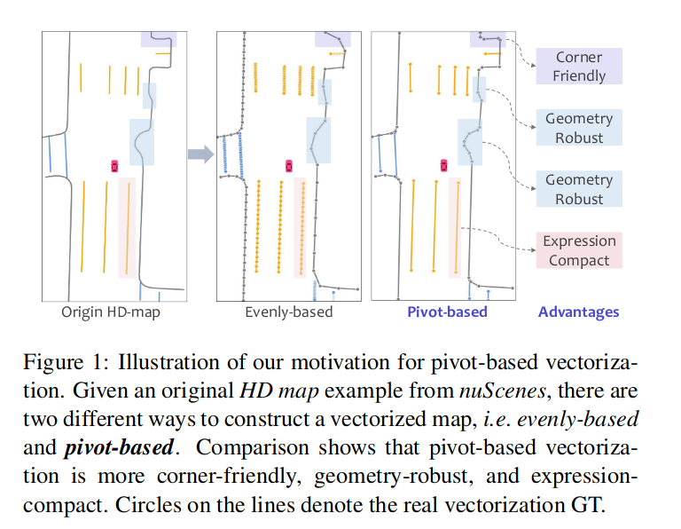

## 在线高精算法论文阅读笔记

[TOC]


### HDMapNet: An Online HD Map Construction and Evaluation Framework

1. 参考文档：
   + 论文：https://www.cnblogs.com/xiaoliu-ya/p/16553462.html
   + 代码：https://github.com/Tsinghua-MARS-Lab/HDMapNet/tree/main

2. 参考笔记的补充：

   + 关于语义预测：很普通的FCN加上交叉损失熵函数；
   + 关于实例预测：
     + 损失函数详见Lanenet。有点疑惑这种依赖参数的表示方式会不会鲁棒性比较差？
     + $C(C-1)$是组合数公式去掉了系数；
   + 关于方向预测：
     + 理解为转换为一个二分类问题，这里其实可以参考环形标签（旋转目标检测）论文来改进方向；
     + 地图上的大多数像素都不位于车道上，这意味着它们没有方向。 这些像素的方向向量是零向量。作者不在训练期间对这些像素进行反向传播。
   + 关于向量化： 在推断过程中，首先使用基于密度的带噪声应用空间聚类 (DBSCAN) 对实例嵌入进行聚类。然后使用非极大值抑制来减少冗余。最后，利用预测的方向贪婪地连接像素，得到向量表示。

3. 代码原理补充：

   + 关于批量标准化图像：

     正向标准化的方程为：$ z = (x - \text{mean}) / \sigma $，因此有：
     $$
     \begin{aligned}
     x &= z * \sigma + \text{mean} \\
       &= (z + \text{mean}/\sigma) * \sigma \\
       &= \left(z - \left(-\text{mean}/\sigma\right)\right) / (1/\sigma) \\
       &= (z - \text{mean}^{-1} )/ \sigma^{-1} \\
      \end{aligned}
     $$
     这解释了代码：

     ```python
     class NormalizeInverse(torchvision.transforms.Normalize):
         #  https://discuss.pytorch.org/t/simple-way-to-inverse-transform-normalization/4821/8
         def __init__(self, mean, std):
             mean = torch.as_tensor(mean)
             std = torch.as_tensor(std)
             std_inv = 1 / (std + 1e-7)
             mean_inv = -mean * std_inv
             # super()：通常在子类中使用，用于在子类中调用父类的方法或属性
             super().__init__(mean=mean_inv, std=std_inv)
     
         # __call__：可以使得方法变成可被调用对象
         def __call__(self, tensor):
             return super().__call__(tensor.clone())
     ```
     
   + 更多内容详见代码笔记文件夹

### VectorMapNet: End-to-end Vectorized HD Map Learning

1. 论文核心点：

   + 与HDMapNet相比，采用了端到端而非HDMapNet中的几何后处理方案，直接输出矢量化而非栅格地图；
   + 使用DETR来检测出关键点，再直接利用生成器矢量化为polyline，以适应地图元素的异构性；

2. 补充信息：

   + Ramer-Douglas-Peucker (RDP) 算法：将曲线用尽量少的点采样成折线的算法

   + Teacher forcing：在训练时，将真实的目标序列作为解码器的输入，而不是将解码器自身生成的序列作为下一时刻的输入；这样可以使模型更容易学习到正确的序列生成方式，但是 open-loop 模式下，模型在训练时和测试的输入会有较大差异，因此通常会在训练过程中随机地使用Teacher Forcing或自回归的方式来训练模型

   +  Fréchet 距离：用于度量两个路径之间相似性的概念。对于两个离散点集 $P=\{p_1,p_2,...,p_N\}$ 和 $Q=\{q_1,q_2,...,q_M\}$，Fréchet距离定义为：
     $$
     \begin{aligned}
     D(i,j) &= ||p_i - q_j||\\
     L(i,j)&=\max\left(D(i,j), \min\left( L(i−1,j), L(i,j−1), L(i−1,j−1) \right) \right) \\
      F(P,Q)&=L(n,m)
      \end{aligned}
     $$

     直观理解Fréchet distance就是：主人走路径A，狗走路径B，各自走完这两条路径过程中所需要的最短狗绳长度。[参考链接](https://blog.csdn.net/qq_40206371/article/details/130039377)

   + Chamfer 距离：用于度量两个点云之间相似性的距离度量。给定两个点云，Chamfer 距离衡量了将一个点云变形到另一个点云所需的最小平均平方距离：
     $$
     \text{Chamfer}(X,Y)=\frac{1}{m}\sum_{i=1}^{m} \min_{j} \| x_i - y_j \|^{2}+\frac{1}{n}\sum_{j=1}^{n} \min_{i} \| y_j - x_i \|^{2}
     $$

   + 多种IoU损失函数总结：https://zhuanlan.zhihu.com/p/388622389

3. 一些没有太理解的点：

   + 注意到元素关键点不同于多段线顶点，元素关键点是VectorMapNet的中间表示，每一类polyline生成的关键点数目恒定；
   + 为什么VectorMapNet 比HDMapNet 性能提高这么多？什么是问题的核心？

4. 实验结果中的比较关键的点：

   + 模型细节：

     + 在不知道地平面精确高度的情况下，这种单应性并不是精确的变换。为了缓解这个问题，在实际中我们将图像特征转化为4个不同高度的BEV平面( 我们用 - 1m , 0m , 1m , 2m )

   + 结论：

     + 向量化的优势：VectorMapNet可以保留尖锐的角点，而 polyline 表示避免了 VectorMapNet 生成模糊的自环绕结果（因为它一致地编码方向信息。相比之下，栅格的方法容易产生虚假循环曲线）。

       

     + 文中性能提高的原因分析：归因于模型对地图要素之间拓扑关系的建模能力，从而隐式地捕捉复杂的场景相互关系。

     + 当自车摄像头被附近车辆遮挡时，VectorMapNet ( Camera )无法感知周围地图。利用LiDAR的深度信息，Vector Map Net ( Fusion )可以得到比相机更可信的结果。

     + polyline采样：第一种，在曲率变化超过一定阈值的位置对顶点进行采样。第二种，是以固定间隔( 1m )对顶点进行采样。结果基于曲率的采样方法大大优于固定采样方法。这是因为固定采样方法涉及大量的冗余顶点集合，这些顶点对几何结构的贡献可以忽略不计，因此在学习过程中低估了基本顶点（例如,折线拐角处的顶点）。

   + 扩展：

     + 使用VectorMapNet来预测中心线：将中心线视为多条线的集合，并隐式地编码它们的拓扑关系。
     + 扩展思考：[为什么要设计两层query呢？](https://www.sohu.com/a/689845043_560178)

5. 文章的缺陷：

   + 缺乏时间信息：模型在单帧中生成一致的几何图形，但不能保证预测的时间一致性；
   + 两阶段模型的失配问题：由于教师强制训练策略，地图元素检测器和折线生成器之间存在特征空间失配。虽然微调对于优化性能是必要的，但它会导致棘手的训练计划；
   + 幻觉能力：模型可以在被遮挡且摄像头不可见的位置进行预测，显示其场景理解能力。然而，这降低了模型的可解释性。
   + 地图要素的点虽然是有序的,但起点不是唯一的：MapTR解决的问题。
   + 较难推理和部署：利用自回归解码器顺序预测点，导致较长的推理时间（生成过程是序列性的,只能做到多个instance的并行,instance内部无法并行,降低了效率）。同时，直接推理到矢量化需要大量数据，很难收敛；

### MapTR: Structured Modeling and Learning for Online Vectorized HD Map Construction

1. 参考文档：

   + https://zhuanlan.zhihu.com/p/671394052

2. 论文核心点：

   + 点集建模：采用`permutation-equivalent`（排列等价）方法：

     + 点集主要分成了两种，包括Polygon和Polyline。Polygon主要就是包含起点和终点的一个顺序，Polygon要复杂点，包括了顺时针和逆时针的各种组合的闭环。
     + MapTR将预测闭环的索引映射到不同的排列中，从而形成一组等效的多边形表示；
     + 这种排列的目的是使得模型在处理排列敏感的多边形数据时能够不受排列顺序的影响，从而减少学习过程中的歧义，使得模型能够更容易、更稳定地学习到正确的多边形表达。统一地对地图元素进行建模，解决了模糊性问题。

   + 网络的真值**匹配**（即训练阶段匈牙利匹配）：和query的设计相同，也采用分层匹配方法，将地图元素集合视为固定大小，依次进行实例级匹配和Point-level匹配。

     + 实例级别的配对采用匈牙利最优匹配，通过类别约束（采用Focal Loss）和位置约束来筛选的；
     + 完成实例匹配后，每个实例中Point-level的配对是通过：预测点与真值等效点集的Manhattan距离约束来筛选的。

   + 网络的训练**损失**：

     + 分类损失：根据实例级的最佳匹配结果，采用Focal Loss预测类别标签；

     + 点对点的损失：根据点级最优匹配结果，采用Manhattan Loss预测每个点的位置；后续实验表明，point2point配对优于Chamfer距离代价；

     + 边缘方向损失：点对点损失只限制了折线和多边形的节点点，没有考虑边缘（相邻点之间的连接线），因此采用成对的预测边缘$ (\hat{e}_{\hat{\pi}(i),j})$ 和 GT 边缘$ (e_{i,\hat{\gamma}_i(j)})$ 的余弦相似度以限制较高边缘层次的几何形状：
       $$
       \mathcal{L}_{dir} = -\sum ^{N −1} _{i=0} \mathbb{1}_{\lbrace c_i \neq \varnothing \rbrace} \sum ^{N_v −1} _{j=0} \rm{cosine\_similarity}(\hat{e}_{\hat{\pi}(i),j},e_{i,\hat{\gamma}_i(j)}) \\
       
       \hat{e}_{\hat{\pi}(i),j} = \hat{v}_{\hat{π}(i),j} − \hat{v}_{\hat{π}(i),(j+1)\mod N_v} , \tag9  \\
       
       e_{i,\hat{\gamma}_i(j)} = v_i,\hat{\gamma}_{i(j)} − v_{i,\hat{\gamma}_i(j+1)\mod N_v} .
       $$

   + 是一种端到端的实时矢量化方案；

   + MapTR还测试了对外参波动的容许度：

     + 角度偏差：0.02rad；平移偏差：0.1m；
     + 但是过大的偏差对性能影响会比较大；

3. 补充细节：
   + Focal Loss：通过在标准交叉熵损失的基础上新增一个系数因子，从而减弱对容易样本的学习和加强对困难样本的学习，提高模型的分类能力。[参考链接](https://zhuanlan.zhihu.com/p/639004674?utm_id=0)
   + Cosine Similarity：余弦相似性工具，主要判断角度变化；[参考链接](https://zhuanlan.zhihu.com/p/628061833)
   + Deformable Attention：[参考链接](https://blog.csdn.net/qq_23981335/article/details/129123581)
4. 一些没有理解的点：
   + MapTR对真值数据进行均匀采样（20个点，实验达到最好的性能，进一步增加点数会增加优化难度，导致性能下降），而非VectorMapNet 推崇的在曲率变化超过一定阈值的位置对顶点进行采样。不清楚为什么采用这个方案；

### MapTRv2: An End-to-End Framework for Online Vectorized HD Map Construction

1. 论文核心点：
   + 为了加快收敛速度，在训练时增加了一对多的辅助匹配分支，以增加正向样本数量：
     + 将真值的地图元素复制k份，地图元素数量增加至 T，因此一个真值地图元素可以匹配k个预测的地图元素。在训练时增加了正样本数量，使得decoder收敛更快。
   + 在透视视图和鸟瞰视图上引入辅助前景分割，并利用深度监督来引导骨干学习三维几何信息；
     + 为了显式地利用深度信息，BEV转换模块由GTK变为了LSS-based BEVPoolv2；
     + QUS：车道线或者道路标识线加入深度监督真的有意义吗？收益比如何呢？
   + 引入了为分层查询机制量身定制的解耦自注意力，极大地减少了内存消耗并带来了增益；
     + MapTR采用的自注意力机制使层次查询之间进行信息交换(既有实例间的,也有实例内的)，计算复杂度较大：点的数量是固定的，但随着实例数的增加，其消耗的内存资源也是逐步增加的；
     + MapTRv2中解耦self-attention，即分别在inter-ins（实例内）和intra-ins（实例外）进行attention操作：后续实验表示，实例自注意力在很大程度上减少了训练内存，同时以可忽略的精度损失为代价。增加实例内的交互后少量增加训练内存，少量增加精度；
   + 提出三种cross-attention方式，分别是基于bev的  cross-attention、基于pv的cross-attention和两者结合的cross-attention：
     + 基于bev的 cross-attention 和 maptr 中的一样，消融实验表明在nus. 2D数据集中表现最佳，帧率相较于pv方法下降不多；
     + 基于pv的 cross-attention，得到预测的参考点集后，在投影到前视图上采集各点周围的特征值；
     + 两者结合的 cross-attention，就是将结合上述两种方式的attention方法，消融实验表明av2. 3D数据中表现最佳，但是帧率有明显的下降。
2. 相关文献：
   + PolyDiffuse：在MapTR中引入扩散机制，通过条件生成过程进一步精化结果；
   + MapVR：将可微的栅格化应用于MapTR产生的矢量化结果，以纳入精确和几何感知的监督；
3. 补充细节：
   + 自注意力机制的图示：[参考链接](https://blog.csdn.net/qq_41129489/article/details/127362272)
4. 疑惑：
   + 似乎对外参的容忍度从v1的0.02rad下降到了0.01rad（0.5°）

### PivotNet: Vectorized Pivot Learning for End-to-end HD Map Construction

1. 论文核心点：
   + 在集合预测框架中采用基于支点/枢纽点（Pivot-Based）表示对地图元素进行精确建模：
     + MapTR固定每种元素的方法导致信息丢失，特别是对于圆角和直角，平滑性也较差；而VectorMapNet采用的由粗到细及自回归方法，会导致较长的推理时间和累积误差；
     + 
   + 点线掩码模块（point-to-line mask module）：
     + 进一步将矢量化后的序列S按对地图要素形状的贡献分为一个枢纽点序列Sp和一个共线点序列Sc。
     + 枢轴序列由一组有序的枢轴点组成，这些枢轴点对整体形状有贡献，并且通常表示地图元素中方向的变化；
     + 
   + 支点动态匹配模块（pivot dynamic matching module）：
   + 动态向量化损失（dynamic vectorized sequence loss）：
